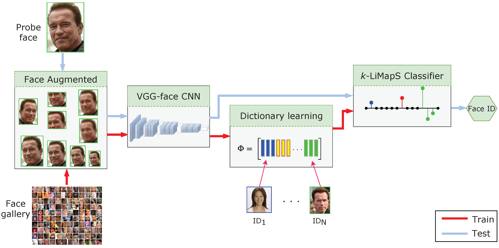

# Robust Single Sample Face Recognition by Sparsity-Driven Sub-Dictionary Learning Using Deep Features

***Vittorio Cuculo¹, Alessandro D'Amelio¹, Giuliano Grossi¹, Raffaella Lanzarotti¹, Jianyi Lin²***  
¹ [PHuSe Lab](https://phuselab.di.unimi.it) - Dipartimento di Informatica, Università degli Studi di Milano  
² Department of Mathematics, Khalifa University of Science and Technology

**Paper** *Cuculo, V., D’Amelio, A., Grossi, G., Lanzarotti, R., & Lin, J. (2019). Robust single-sample face recognition by sparsity-driven sub-dictionary learning using deep features. Sensors, 19(1), 146.*

https://www.mdpi.com/1424-8220/19/1/146  



### Requirements

To execute the code, please make sure that the following packages are installed:

- python 3.6.5
- scikit-learn 0.20.0


### Executing the demo

To launch the classification test on LFW-158 subset:

1. Download the pre-processed data (~10GB unzipped):
```
./download_data.sh
```
2. Run the following command:
```
python3 main.py

[...]

Number of images: 4165

Accuracy: 94.23769507803121%

```

### Reference

If you use this code or data, please cite the paper:
```
@Article{s19010146,
AUTHOR = {Cuculo, Vittorio and D’Amelio, Alessandro and Grossi, Giuliano and Lanzarotti, Raffaella and Lin, Jianyi},
TITLE = {Robust Single-Sample Face Recognition by Sparsity-Driven Sub-Dictionary Learning Using Deep Features},
JOURNAL = {Sensors},
VOLUME = {19},
YEAR = {2019},
NUMBER = {1},
ARTICLE-NUMBER = {146},
URL = {http://www.mdpi.com/1424-8220/19/1/146},
ISSN = {1424-8220},
DOI = {10.3390/s19010146}
}
```

### License

This project is licensed under the MIT License - see the [LICENSE](LICENSE) file for details

### Acknowledgments

We gratefully acknowledge the support of NVIDIA Corporation with the donation of the Quadro P6000 GPU used for this research.
